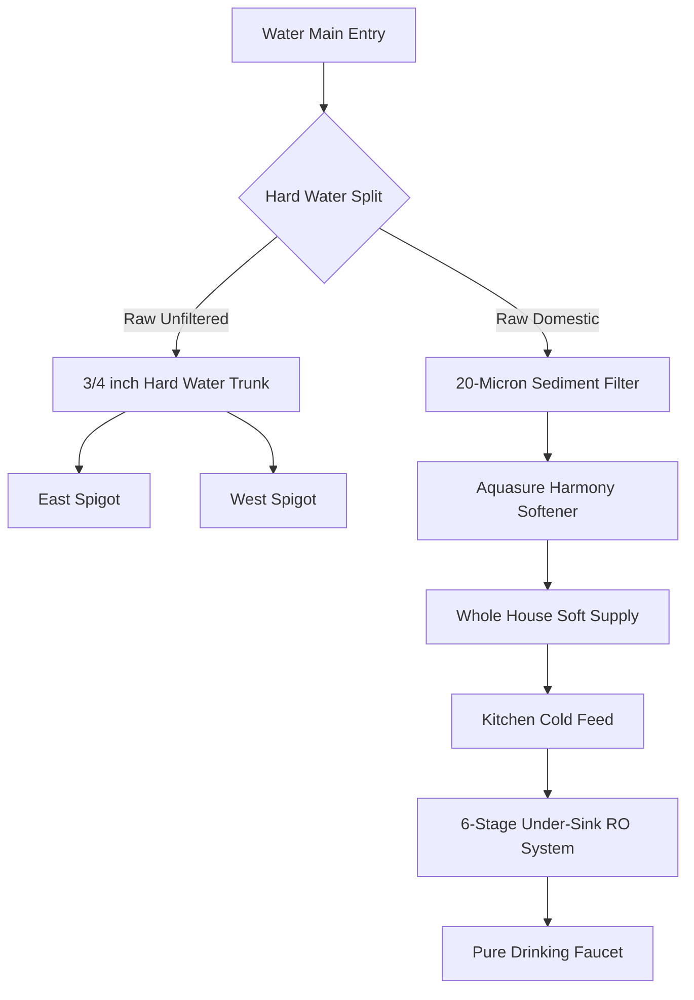
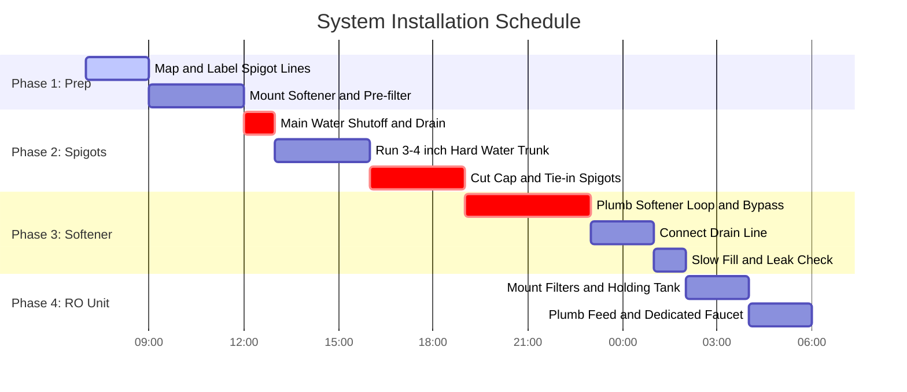

# Water Infrastructure & Filtration Architecture

This runbook outlines the custom whole-house treatment deployment, hard-water isolation modifications, and sub-sink reverse osmosis purification configurations.

## System Topology

## Installation & Remediation Timeline
The baseline timeline for executing the plumbing modifications and system deployment involves a targeted 12-hour main water line shutdown window.

## Bill of Materials (BOM) & Costs
| Component | Target Model | Estimated Cost | Role |
| :--- | :--- | :--- | :--- |
| **Water Softener** | Aquasure Harmony (32k Grains) | '$420.00' | Whole house softening |
| **RO System** | iSpring RCC7AK (6-Stage) | '$220.00' | Fluoride & contaminant removal |
| **Pre-Filter** | 20-Micron Spun Sediment | '$25.00' | Valving protection |
| **PEX-B Supplies** | 3/4" & 1/2" Coils + Crimp Rings | '$50.00' | Hard water trunk construction |
| **Tools & Valves** | PEX Crimp Tool + Ball Valves | '$85.00' | Isolation and installation |

## Critical Runbooks

### Emergency Softener Bypass Procedure

If the softener leaks or undergoes mechanical valve failure:
1. Locate the black bypass valve assembly on the rear of the Aquasure control head.
1. Turn both red dial arrows so they point inward toward each other (perpendicular to the pipes).
1. The house is now running completely on unsoftened raw municipal water; the unit is safely isolated.

