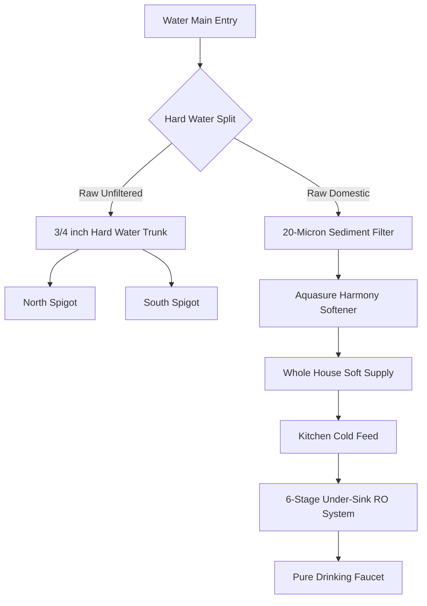

# Water Infrastructure & Filtration Architecture

This runbook outlines the custom whole-house treatment deployment, hard-water isolation modifications, and sub-sink reverse osmosis purification configurations.

## System Topology



## Installation & Remediation Timeline
The baseline timeline for executing the plumbing modifications and system deployment involves a targeted 12-hour main water line shutdown window.

```mermaid
gantt
    title System Installation Schedule
    dateFormat  YYYY-MM-DD HH:mm
    axisFormat  %H:%M

    section Phase 1: Prep
    Map and Label Spigot Lines       :active, p1_1, 2026-06-19 07:00, 120m
    Mount Softener and Pre-filter     : p1_3, after p1_1, 180m

    section Phase 2: Spigots
    Main Water Shutoff and Drain      :critical, p2_1, after p1_3, 60m
    Run 3/4 inch Hard Water Trunk       : p2_2, after p2_1, 180m
    Cut, Cap and Tie-in Spigots      :critical, p2_3, after p2_2, 180m

    section Phase 3: Softener
    Plumb Softener Loop and Bypass    :critical, p3_1, after p2_3, 240m
    Connect Drain Line              : p3_2, after p3_1, 120m
    Slow Fill and Leak Check          : p3_3, after p3_2, 60m

    section Phase 4: RO Unit
    Mount Filters and Holding Tank    : p4_1, after p3_3, 120m
    Plumb Feed and Dedicated Faucet   : p4_3, after p4_1, 120m
```

## Bill of Materials (BOM) & Costs
| Component | Target Model | Estimated Cost | Role |
| :--- | :--- | :--- | :--- |
| **Water Softener** | Aquasure Harmony (32k Grains) | \$420.00 | Whole house softening |
| **RO System** | iSpring RCC7AK (6-Stage) | \$220.00 | Fluoride & contaminant removal |
| **Pre-Filter** | 20-Micron Spun Sediment | \$25.00 | Valving protection |
| **PEX-B Supplies** | 3/4" & 1/2" Coils + Crimp Rings | \$50.00 | Hard water trunk construction |
| **Tools & Valves** | PEX Crimp Tool + Ball Valves | \$85.00 | Isolation and installation |

## Critical Runbooks
Emergency Softener Bypass Procedure
If the softener leaks or undergoes mechanical valve failure:
1. Locate the black bypass valve assembly on the rear of the Aquasure control head.
1. Turn both red dial arrows so they point inward toward each other (perpendicular to the pipes).
1. The house is now running completely on unsoftened raw municipal water; the unit is safely isolated.

